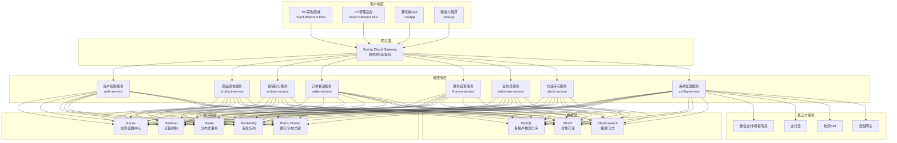
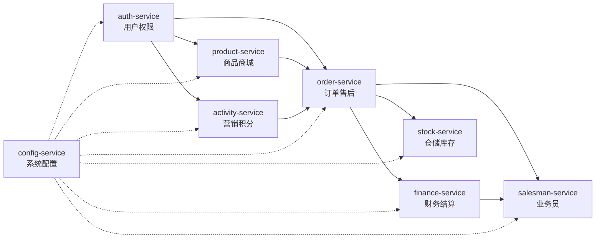
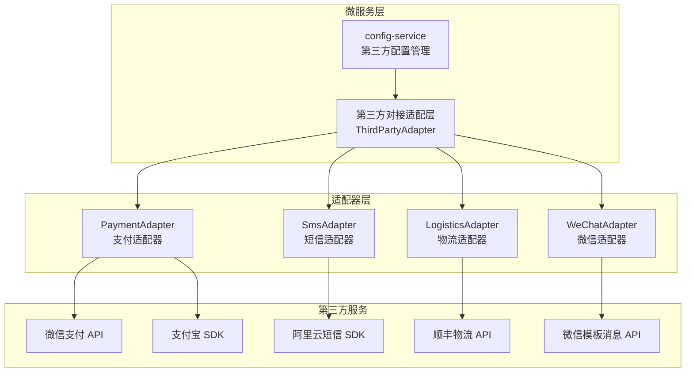

# 医药B2B私域一体化平台 — 系统架构文档

> 版本：v1.0 | 更新日期：2026-07-12 | 编写：架构组

---

## 目录

- [1. 系统整体架构图](#1-系统整体架构图)
- [2. 微服务拆分说明](#2-微服务拆分说明)
- [3. 多租户隔离方案](#3-多租户隔离方案)
- [4. 分布式事务方案（Seata）](#4-分布式事务方案seata)
- [5. 数据权限分层隔离方案](#5-数据权限分层隔离方案)
- [6. 消息推送体系设计](#6-消息推送体系设计)
- [7. 第三方接口对接方案](#7-第三方接口对接方案)
- [8. 部署架构](#8-部署架构)

---

## 1. 系统整体架构图

### 1.1 系统全景架构图



### 1.2 请求流转图

```
┌──────────────┐     ┌───────────────┐     ┌──────────────────┐
│  客户端请求   │────▶│  Gateway 网关  │────▶│  微服务 Controller │
│              │     │               │     │                  │
│ Authorization│     │ - 路由转发     │     │ - 参数校验        │
│ X-Tenant-Id  │     │ - Token鉴权   │     │ - 租户上下文绑定   │
│              │     │ - 租户路由     │     │ - 权限校验        │
└──────────────┘     │ - 限流熔断     │     │ - 业务处理        │
                     └───────────────┘     └────────┬─────────┘
                                                    │
                    ┌──────────────────┐            │
                    │  Service 业务层   │◀───────────┘
                    │                  │
                    │ - 事务管理       │
                    │ - 分布式事务AT   │
                    │ - 数据权限过滤   │
                    │ - 缓存读写       │
                    └────────┬─────────┘
                             │
                    ┌────────┴─────────┐
                    │                  │
           ┌────────▼──────┐  ┌───────▼────────┐
           │  MySQL 数据库  │  │  Redis 缓存    │
           │  (租户分库)    │  │  (租户隔离前缀) │
           └───────────────┘  └────────────────┘
```

---

## 2. 微服务拆分说明

### 2.1 服务清单

| 序号 | 服务名称 | 服务标识 | 端口 | 职责说明 |
|------|----------|----------|------|----------|
| 1 | 用户权限服务 | `auth-service` | 8101 | 用户认证、RBAC权限、客户档案、药品流向授权 |
| 2 | 商品商城服务 | `product-service` | 8102 | 商品SKU管理、分类品牌、商城装修、短视频内容 |
| 3 | 营销积分服务 | `activity-service` | 8103 | 促销活动、定向优惠审批、积分规则/账户/兑换 |
| 4 | 订单售后服务 | `order-service` | 8104 | 采购订单全流程、售后申请/审核/退款、物流 |
| 5 | 财务结算服务 | `finance-service` | 8105 | 资金流水、对公对账、提现审批、账期管理 |
| 6 | 业务员服务 | `salesman-service` | 8106 | 业务员档案、客户绑定、提成规则/记录、业绩看板 |
| 7 | 仓储库存服务 | `stock-service` | 8107 | 仓库管理、库存出入库/调拨/盘点、缺货订阅 |
| 8 | 系统配置服务 | `config-service` | 8108 | 系统参数配置、消息模板/推送、第三方接口配置 |

### 2.2 服务间依赖关系



### 2.3 服务间通信方式

| 通信场景 | 方式 | 说明 |
|----------|------|------|
| 同步调用 | OpenFeign | 用于强一致性要求的场景，如订单创建时扣减库存 |
| 异步消息 | RocketMQ | 用于解耦场景，如订单支付成功后触发积分发放、消息推送 |
| 事件通知 | RocketMQ Transactional Message | 用于分布式事务最终一致性场景 |

### 2.4 核心服务间调用链路

**下单链路**：
```
order-service (创建订单)
  ├── Feign → auth-service (校验客户状态/授权)
  ├── Feign → product-service (校验商品/获取价格)
  ├── Feign → stock-service (锁定库存)
  ├── Seata → 全局事务协调
  └── MQ → activity-service (扣减活动库存)
         → config-service (发送订单通知)
```

**支付完成链路**：
```
order-service (支付回调)
  ├── Feign → finance-service (记录资金流水)
  ├── MQ → activity-service (积分发放)
  ├── MQ → config-service (支付成功通知)
  └── MQ → salesman-service (提成计算)
```

---

## 3. 多租户隔离方案

### 3.1 隔离架构

本平台采用**物理分库 + 逻辑隔离**的混合方案：

```
┌──────────────────────────────────────────────────┐
│                  公共库 (pharma_common)            │
│                                                  │
│  sys_tenant (租户表)                              │
│  ┌─────┬─────────────┬──────────────────┐       │
│  │ id  │ tenant_code │ database_name     │       │
│  ├─────┼─────────────┼──────────────────┤       │
│  │  1  │ T001        │ pharma_tenant_1   │       │
│  │  2  │ T002        │ pharma_tenant_2   │       │
│  │  3  │ T003        │ pharma_tenant_3   │       │
│  └─────┴─────────────┴──────────────────┘       │
└──────────────────────────────────────────────────┘
         │                    │               │
         ▼                    ▼               ▼
┌─────────────────┐ ┌─────────────────┐ ┌─────────────────┐
│ pharma_tenant_1 │ │ pharma_tenant_2 │ │ pharma_tenant_3 │
│                 │ │                 │ │                 │
│ sys_user        │ │ sys_user        │ │ sys_user        │
│ sys_role        │ │ sys_role        │ │ sys_role        │
│ biz_product     │ │ biz_product     │ │ biz_product     │
│ biz_order       │ │ biz_order       │ │ biz_order       │
│ ...全部业务表    │ │ ...全部业务表    │ │ ...全部业务表    │
└─────────────────┘ └─────────────────┘ └─────────────────┘
```

### 3.2 数据源动态路由

```java
// 基于 AbstractRoutingDataSource 实现动态数据源切换
public class TenantRoutingDataSource extends AbstractRoutingDataSource {
    @Override
    protected Object determineCurrentLookupKey() {
        return TenantContextHolder.getTenantDataSourceKey();
    }
}

// 租户上下文拦截器
public class TenantInterceptor implements HandlerInterceptor {
    @Override
    public boolean preHandle(HttpServletRequest req, HttpServletResponse resp, Object handler) {
        String tenantId = req.getHeader("X-Tenant-Id");
        // 1. 从公共库查询租户的数据库连接信息
        TenantConfig config = tenantService.getTenantConfig(tenantId);
        // 2. 设置到 ThreadLocal
        TenantContextHolder.setTenantDataSourceKey(config.getDatabaseName());
        return true;
    }
    
    @Override
    public void afterCompletion(...) {
        TenantContextHolder.clear();
    }
}
```

### 3.3 Redis 多租户隔离

```
# Key 命名规范：tenant:{tenant_id}:{业务前缀}:{业务Key}

# 示例：
tenant:1:user:token:abc123          # 用户Token
tenant:1:product:hot:list            # 热销商品列表
tenant:1:stock:lock:5001             # 库存分布式锁
tenant:1:order:seq:20260712          # 订单号序列
```

### 3.4 MinIO 多租户隔离

```
# Bucket 命名规范：pharma-{tenant_id}

# 示例对象路径：
pharma-1/product/5001/main.jpg       # 商品图片
pharma-1/video/6001.mp4              # 短视频
pharma-1/order/evidence/10001.jpg    # 售后凭证
```

### 3.5 Elasticsearch 多租户隔离

```
# Index 命名规范：pharma_{tenant_id}_{index_type}

# 示例：
pharma_1_product       # 租户1的商品索引
pharma_1_order         # 租户1的订单索引
pharma_2_product       # 租户2的商品索引
```

---

## 4. 分布式事务方案（Seata）

### 4.1 Seata 架构

```
┌─────────────────────────────────────────────────────┐
│                   Seata Coordinator                  │
│                   (TC - 事务协调器)                   │
│                   独立集群部署                        │
└──────────────┬──────────────────────────────────────┘
               │
    ┌──────────┼──────────┐
    │          │          │
    ▼          ▼          ▼
┌────────┐ ┌────────┐ ┌────────┐
│ TM     │ │ RM     │ │ RM     │
│ order  │ │ stock  │ │ finance│
│ service│ │ service│ │ service│
│        │ │        │ │        │
│ 全局事务│ │ 分支事务│ │ 分支事务│
│ 开启/提交│ │ 注册/提交│ │ 注册/提交│
└────────┘ └────────┘ └────────┘
```

### 4.2 AT 模式（自动补偿）

适用于大多数跨服务事务场景，业务代码无侵入。

**典型场景：下单扣库存**

```java
@GlobalTransactional(name = "createOrder", timeoutMills = 60000)
public OrderCreateResult createOrder(OrderCreateRequest request) {
    // 1. 创建订单（order-service 本地事务）
    Order order = orderMapper.insert(orderEntity);
    
    // 2. 远程调用扣减库存（stock-service 本地事务）
    stockFeignClient.lockStock(order.getOrderId());
    
    // 3. 远程调用扣减积分（activity-service 本地事务）
    pointsFeignClient.deductPoints(order.getPointsUsed());
    
    // 如果以上任一步骤失败，Seata TC 自动执行各分支的回滚
    return result;
}
```

**undo_log 表**（每个租户库中创建）：

```sql
CREATE TABLE `undo_log` (
  `branch_id`     BIGINT UNSIGNED NOT NULL COMMENT '分支事务ID',
  `xid`           VARCHAR(128)    NOT NULL COMMENT '全局事务ID',
  `context`       VARCHAR(128)    NOT NULL COMMENT '上下文',
  `rollback_info` LONGBLOB        NOT NULL COMMENT '回滚信息',
  `log_status`    INT             NOT NULL COMMENT '状态',
  `log_created`   DATETIME        NOT NULL COMMENT '创建时间',
  `log_modified`  DATETIME        NOT NULL COMMENT '修改时间',
  UNIQUE KEY `ux_undo_log` (`xid`, `branch_id`)
) ENGINE=InnoDB COMMENT='Seata AT模式undo_log表';
```

### 4.3 TCC 模式（手动补偿）

适用于需要强一致性的资金类操作。

**典型场景：提现打款**

```java
// TCC 三阶段：Try → Confirm/Cancel

// Try: 冻结提现金额
@TwoPhaseBusinessAction(name = "freezeWithdrawalAmount", 
    commitMethod = "confirmFreeze", rollbackMethod = "cancelFreeze")
public boolean tryFreeze(BusinessActionContext ctx, 
                         @BusinessActionContextParameter("salesmanId") Long salesmanId,
                         @BusinessActionContextParameter("amount") BigDecimal amount) {
    // 冻结佣金余额
    commissionMapper.freezeAmount(salesmanId, amount);
    return true;
}

// Confirm: 确认扣减
public boolean confirmFreeze(BusinessActionContext ctx) {
    Long salesmanId = ctx.getActionContext("salesmanId").longValue();
    BigDecimal amount = ctx.getActionContext("amount");
    commissionMapper.deductFrozenAmount(salesmanId, amount);
    return true;
}

// Cancel: 解冻返还
public boolean cancelFreeze(BusinessActionContext ctx) {
    Long salesmanId = ctx.getActionContext("salesmanId").longValue();
    BigDecimal amount = ctx.getActionContext("amount");
    commissionMapper.unfreezeAmount(salesmanId, amount);
    return true;
}
```

### 4.4 事务场景一览

| 业务场景 | 涉及服务 | 事务模式 | 说明 |
|----------|----------|----------|------|
| 下单扣库存 | order → stock | AT | 订单创建+库存锁定 |
| 支付完成 | order → finance → activity | AT | 流水记录+积分发放 |
| 售后退款 | after-sale → finance → stock | AT | 退款+库存归还+积分扣回 |
| 提现打款 | finance → 银行 | TCC | 佣金冻结+银行打款 |
| 库存调拨 | stock → stock | AT | 调出+调入 |

### 4.5 最终一致性方案（MQ）

对于非强一致性要求的场景，使用 RocketMQ 事务消息：

```java
// 场景：订单支付成功后异步发放积分
// 1. 发送半事务消息
TransactionMQProducer producer = new TransactionMQProducer("order_producer");
Message msg = new Message("POINTS_TOPIC", "PAY_SUCCESS", orderNo.getBytes());
producer.sendMessageInTransaction(msg, null);

// 2. 执行本地事务（更新订单支付状态）
@Override
public LocalTransactionState executeLocalTransaction(Message msg, Object arg) {
    try {
        orderService.updatePaymentStatus(orderNo, PaymentStatus.PAID);
        return LocalTransactionState.COMMIT_MESSAGE;
    } catch (Exception e) {
        return LocalTransactionState.ROLLBACK_MESSAGE;
    }
}

// 3. 积分服务消费消息，发放积分（如果消费失败MQ会自动重试）
@RocketMQMessageListener(topic = "POINTS_TOPIC", consumerGroup = "points_consumer")
public class PointsConsumer implements RocketMQListener<String> {
    @Override
    public void onMessage(String orderNo) {
        pointsService.grantPoints(orderNo);
    }
}
```

---

## 5. 数据权限分层隔离方案

### 5.1 权限模型

本平台采用 **RBAC + 数据范围** 的双重权限控制：

```
┌─────────────────────────────────────────────────┐
│                  权限分层模型                     │
│                                                 │
│  用户(User) ──▶ 角色(Role) ──▶ 权限(Permission)  │
│      │              │                           │
│      │              ├── 功能权限（菜单/按钮/接口） │
│      │              └── 数据范围（DataScope）     │
│      │                          │               │
│      │                    ┌─────┼─────┐         │
│      │                    │     │     │         │
│      │                   全部  本人  本部门      │
│      │                              自定义       │
│      │                                           │
│      └──▶ 业务员数据隔离                          │
│            （仅可见自己绑定的客户数据）              │
└─────────────────────────────────────────────────┘
```

### 5.2 六类角色数据权限

| 角色 | 功能权限 | 数据范围 | 说明 |
|------|----------|----------|------|
| 平台管理员 | 全部 | 全部租户 | 跨租户管理，运维级别 |
| 租户管理员 | 租户内全部 | 本租户全部数据 | 租户最高权限 |
| 采购员 | 采购商城功能 | 本人数据 | 仅看自己的订单/收藏 |
| 业务员 | 客户/订单/提成 | 本部门+绑定客户 | 可见绑定客户的订单和自己的提成 |
| 财务 | 财务/订单/售后 | 本租户全部财务数据 | 资金流水/对账/提现审批 |
| 仓库管理员 | 仓储/库存 | 本仓库数据 | 仅管理所属仓库的库存 |

### 5.3 MyBatis-Plus 数据权限拦截器

```java
@Intercepts({
    @Signature(type = StatementHandler.class, method = "prepare", 
               args = {Connection.class, Integer.class})
})
public class DataPermissionInterceptor implements Interceptor {
    
    @Override
    public Object intercept(Invocation invocation) throws Throwable {
        // 1. 获取当前登录用户
        LoginUser user = SecurityContextHolder.getCurrentUser();
        
        // 2. 获取数据范围配置
        DataScope scope = user.getDataScope();
        
        // 3. 根据数据范围拼接SQL条件
        String sql = originalSql;
        switch (scope.getType()) {
            case ALL:
                // 不加条件
                break;
            case SELF:
                sql = addCondition(sql, "created_by = " + user.getId());
                break;
            case DEPARTMENT:
                sql = addCondition(sql, "created_by IN (SELECT user_id FROM sys_user WHERE department = '" 
                    + user.getDepartment() + "')");
                break;
            case SALESMAN_CUSTOMER:
                // 业务员仅可见绑定客户的数据
                sql = addCondition(sql, "customer_id IN (SELECT customer_id FROM biz_salesman_customer "
                    + "WHERE salesman_id = " + user.getSalesmanId() + " AND status = 1)");
                break;
            case WAREHOUSE:
                // 仓库管理员仅可见所属仓库
                sql = addCondition(sql, "warehouse_id = " + user.getWarehouseId());
                break;
            case CUSTOM:
                sql = addCondition(sql, "created_by IN (" + scope.getCustomUserIds() + ")");
                break;
        }
        
        return invocation.proceed();
    }
}
```

### 5.4 药品流向授权数据隔离

药品流向授权是医药B2B平台的特殊数据隔离机制：

```
┌───────────────────────────────────────────────────┐
│              药品流向授权数据流                      │
│                                                   │
│  业务员/经销商                                      │
│       │                                           │
│       ▼                                           │
│  创建授权（biz_drug_authorization）                 │
│       │                                           │
│       ├── 授权客户: 健康大药房                      │
│       ├── 授权药品: 阿莫西林胶囊                    │
│       ├── 授权价格: 22元/盒                        │
│       └── 有效期: 2026-01-01 ~ 2026-12-31         │
│                                                   │
│       ▼                                           │
│  采购员登录商城                                     │
│       │                                           │
│       ├── 身份: 健康大药房的采购员                   │
│       ├── 商品列表: 仅展示已授权药品                 │
│       ├── 商品价格: 显示授权价（22元）而非默认价       │
│       └── 下单校验: 校验药品+客户+价格+有效期        │
│                                                   │
│       ▼                                           │
│  订单创建（校验通过 → 允许下单）                     │
└───────────────────────────────────────────────────┘
```

**授权校验逻辑**：

```java
public void validateAuthorization(Long customerId, Long productId, BigDecimal orderPrice) {
    // 查询有效授权
    DrugAuthorization auth = authorizationMapper.findValidAuth(customerId, productId, LocalDateTime.now());
    
    if (auth == null) {
        throw new BizException(20003, "该药品未授权给当前客户");
    }
    
    // 校验授权价格
    if (auth.getAuthorizedPrice() != null 
        && orderPrice.compareTo(auth.getAuthorizedPrice()) < 0) {
        throw new BizException(20003, "订单价格低于授权最低价");
    }
    
    // 校验有效期
    if (auth.getEndAt() != null && auth.getEndAt().isBefore(LocalDateTime.now())) {
        throw new BizException(20003, "药品授权已过期");
    }
}
```

---

## 6. 消息推送体系设计

### 6.1 消息推送架构

```
┌──────────────────────────────────────────────────────────────┐
│                    消息推送体系架构                             │
│                                                              │
│  ┌──────────────┐                                            │
│  │ 业务事件触发   │                                            │
│  │ (订单/活动等)  │                                            │
│  └──────┬───────┘                                            │
│         │                                                    │
│         ▼                                                    │
│  ┌──────────────┐     ┌──────────────┐                      │
│  │ RocketMQ     │────▶│ 消息消费分发   │                      │
│  │ Topic        │     │ (config-svc) │                      │
│  └──────────────┘     └──────┬───────┘                      │
│                              │                               │
│              ┌───────────────┼───────────────┐               │
│              │               │               │               │
│              ▼               ▼               ▼               │
│      ┌──────────────┐ ┌──────────────┐ ┌──────────────┐     │
│      │ 站内信推送    │ │ 短信推送      │ │ 微信推送      │     │
│      │              │ │              │ │              │     │
│      │ → DB写入     │ │ → 短信网关API │ │ → 微信模板消息│     │
│      │ → Redis缓存  │ │              │ │              │     │
│      └──────────────┘ └──────────────┘ └──────────────┘     │
│                                                              │
│              ┌───────────────┐                               │
│              │ 邮件推送       │                               │
│              │ → SMTP        │                               │
│              └───────────────┘                               │
└──────────────────────────────────────────────────────────────┘
```

### 6.2 消息模板变量设计

```json
{
  "templateCode": "ORDER_PAY_SUCCESS",
  "channel": 1,
  "title": "订单支付成功通知",
  "content": "尊敬的${customerName}，您的订单${orderNo}已支付成功，金额${payAmount}元，我们将尽快为您发货。",
  "variables": [
    { "name": "customerName", "desc": "客户名称" },
    { "name": "orderNo", "desc": "订单编号" },
    { "name": "payAmount", "desc": "支付金额" }
  ]
}
```

### 6.3 业务消息场景

| 业务场景 | 触发事件 | 推送渠道 | 模板编码 |
|----------|----------|----------|----------|
| 订单创建 | 业务员下单 | 站内信+微信 | `ORDER_CREATED` |
| 支付成功 | 支付回调 | 站内信+短信 | `ORDER_PAY_SUCCESS` |
| 订单发货 | 仓库发货 | 站内信+微信 | `ORDER_SHIPPED` |
| 签收确认 | 物流回调 | 站内信 | `ORDER_CONFIRMED` |
| 售后审核 | 管理员审核 | 站内信+短信 | `AFTER_SALE_AUDIT` |
| 退款完成 | 财务退款 | 站内信+微信 | `REFUND_COMPLETED` |
| 提现审批 | 管理员审批 | 站内信+短信 | `WITHDRAWAL_AUDIT` |
| 活动审批 | 管理员审批 | 站内信 | `ACTIVITY_AUDIT` |
| 积分到账 | 订单完成 | 站内信 | `POINTS_GRANTED` |
| 缺货到货 | 库存补货 | 站内信+短信 | `STOCK_AVAILABLE` |
| 账期提醒 | 定时任务 | 站内信+短信 | `CREDIT_DUE_REMIND` |
| 授权变更 | 授权操作 | 站内信+微信 | `AUTHORIZATION_CHANGED` |

### 6.4 消息重试机制

```java
// 消息发送失败重试策略
public class MessageRetryStrategy {
    // 最大重试次数
    private static final int MAX_RETRY = 3;
    // 重试间隔（秒）：指数退避
    private static final long[] RETRY_INTERVALS = {10, 60, 300};
    
    public void sendWithRetry(MessageRecord record) {
        for (int i = 0; i <= MAX_RETRY; i++) {
            try {
                sendMessage(record);
                record.setSendStatus(SendStatus.SENT);
                return;
            } catch (Exception e) {
                record.setRetryCount(i + 1);
                record.setErrorMsg(e.getMessage());
                if (i < MAX_RETRY) {
                    Thread.sleep(RETRY_INTERVALS[i] * 1000);
                }
            }
        }
        record.setSendStatus(SendStatus.FAILED);
        messageRecordMapper.updateById(record);
        
        // 发送失败告警
        alertService.sendAlert("消息发送失败: " + record.getId());
    }
}
```

---

## 7. 第三方接口对接方案

### 7.1 第三方服务总览

| 服务商 | 用途 | 对接方式 | 配置位置 |
|--------|------|----------|----------|
| 微信支付 | 在线支付 | API v3 | sys_third_party_config |
| 支付宝 | 在线支付 | SDK | sys_third_party_config |
| 微信公众号/小程序 | 模板消息推送 | API | sys_third_party_config |
| 阿里云短信 | 短信推送 | SDK | sys_third_party_config |
| 顺丰物流 | 物流查询/下单 | API | sys_third_party_config |
| 京东物流 | 物流查询/下单 | API | sys_third_party_config |
| 企业微信 | 内部通知/审批 | API | sys_third_party_config |
| 电子签章 | 合同签署 | API | sys_third_party_config |

### 7.2 对接架构



### 7.3 适配器设计模式

```java
// 统一支付接口
public interface PaymentProvider {
    PaymentResult pay(PaymentRequest request);
    RefundResult refund(RefundRequest request);
    PaymentQueryResult query(String tradeNo);
}

// 微信支付实现
@Slf4j
public class WeChatPayProvider implements PaymentProvider {
    @Override
    public PaymentResult pay(PaymentRequest request) {
        // 调用微信支付API v3
        WeChatPayConfig config = getConfig();
        // ... 构建请求、签名、调用
        return PaymentResult.success(prepayId);
    }
}

// 支付宝实现
public class AlipayProvider implements PaymentProvider {
    @Override
    public PaymentResult pay(PaymentRequest request) {
        // 调用支付宝SDK
        return PaymentResult.success(tradeNo);
    }
}

// 支付工厂
public class PaymentFactory {
    public static PaymentProvider getProvider(String providerCode) {
        return switch (providerCode) {
            case "wechat" -> new WeChatPayProvider();
            case "alipay" -> new AlipayProvider();
            default -> throw new IllegalArgumentException("不支持的支付渠道: " + providerCode);
        };
    }
}
```

### 7.4 Token 管理与自动刷新

```java
// 微信 Access Token 自动刷新
@Component
public class WeChatTokenManager {
    @Autowired
    private RedisTemplate<String, String> redisTemplate;
    
    private static final String TOKEN_KEY = "tenant:{tenantId}:wechat:access_token";
    
    public String getAccessToken(Long tenantId) {
        String key = TOKEN_KEY.replace("{tenantId}", tenantId.toString());
        String token = redisTemplate.opsForValue().get(key);
        
        if (token == null) {
            // Redis中不存在，从微信API获取
            token = fetchNewToken(tenantId);
            // 存入Redis，提前5分钟过期
            redisTemplate.opsForValue().set(key, token, 
                Duration.ofSeconds(7200 - 300));
        }
        return token;
    }
    
    private String fetchNewToken(Long tenantId) {
        // 调用微信API获取新token
        WeChatConfig config = configService.getWeChatConfig(tenantId);
        // ...
        return accessToken;
    }
}
```

---

## 8. 部署架构

### 8.1 整体部署拓扑

```
┌─────────────────────────────────────────────────────────────┐
│                       CDN / SLB                              │
│                    (HTTPS 终结 + 负载均衡)                    │
└────────────────────────┬────────────────────────────────────┘
                         │
         ┌───────────────┼───────────────┐
         │               │               │
         ▼               ▼               ▼
  ┌──────────────┐ ┌──────────────┐ ┌──────────────┐
  │  K8s Node 1  │ │  K8s Node 2  │ │  K8s Node 3  │
  │              │ │              │ │              │
  │ Gateway Pod  │ │ Gateway Pod  │ │ Gateway Pod  │
  │ auth Pod     │ │ auth Pod     │ │ auth Pod     │
  │ product Pod  │ │ product Pod  │ │ product Pod  │
  │ order Pod    │ │ order Pod    │ │ order Pod    │
  │ ...其他服务   │ │ ...其他服务   │ │ ...其他服务   │
  └──────┬───────┘ └──────┬───────┘ └──────┬───────┘
         │                │                │
         └────────────────┼────────────────┘
                          │
          ┌───────────────┼───────────────┐
          │               │               │
          ▼               ▼               ▼
  ┌──────────────┐ ┌──────────────┐ ┌──────────────┐
  │  MySQL 主从  │ │  Redis集群   │ │  MinIO集群   │
  │              │ │              │ │              │
  │ Master(写)   │ │ 3主3从       │ │ 4节点        │
  │ Slave(读)    │ │              │ │              │
  │              │ │              │ │              │
  │ +公共库      │ │              │ │              │
  │ +租户分库    │ │              │ │              │
  └──────────────┘ └──────────────┘ └──────────────┘
          │               │               │
          ▼               ▼               ▼
  ┌──────────────┐ ┌──────────────┐ ┌──────────────┐
  │ Elasticsearch│ │  RocketMQ    │ │  Seata TC    │
  │  3节点集群   │ │  集群        │ │  集群        │
  └──────────────┘ └──────────────┘ └──────────────┘
```

### 8.2 K8s 部署清单

```yaml
# 以 order-service 为例的 Deployment
apiVersion: apps/v1
kind: Deployment
metadata:
  name: order-service
  namespace: pharma-b2b
spec:
  replicas: 3
  selector:
    matchLabels:
      app: order-service
  template:
    metadata:
      labels:
        app: order-service
    spec:
      containers:
      - name: order-service
        image: registry.cn-shenzhen.aliyuncs.com/pharma-b2b/order-service:latest
        ports:
        - containerPort: 8104
        env:
        - name: NACOS_SERVER_ADDR
          value: "nacos:8848"
        - name: SEATA_SERVER_ADDR
          value: "seata-tc:8091"
        - name: JAVA_OPTS
          value: "-Xms512m -Xmx1024m -Dspring.profiles.active=prod"
        resources:
          requests:
            memory: "512Mi"
            cpu: "250m"
          limits:
            memory: "1536Mi"
            cpu: "1000m"
        livenessProbe:
          httpGet:
            path: /actuator/health
            port: 8104
          initialDelaySeconds: 60
          periodSeconds: 30
        readinessProbe:
          httpGet:
            path: /actuator/health/readiness
            port: 8104
          initialDelaySeconds: 30
          periodSeconds: 10
```

### 8.3 环境规划

| 环境 | 命名空间 | 副本数 | 说明 |
|------|----------|--------|------|
| 开发环境 (dev) | `pharma-dev` | 1 | 开发人员联调 |
| 测试环境 (test) | `pharma-test` | 1 | QA测试 |
| 预发环境 (staging) | `pharma-staging` | 2 | 上线前验证 |
| 生产环境 (prod) | `pharma-b2b` | 3+ | 正式生产 |

### 8.4 监控与运维

```
┌──────────────────────────────────────────────────┐
│                  监控告警体系                      │
│                                                  │
│  ┌──────────────┐    ┌──────────────────┐        │
│  │ Prometheus   │───▶│  Grafana 看板    │        │
│  │ 指标采集      │    │  - JVM监控       │        │
│  │              │    │  - 接口QPS/延迟   │        │
│  │              │    │  - 数据库连接池   │        │
│  │              │    │  - Redis命中率    │        │
│  └──────────────┘    └──────────────────┘        │
│                                                  │
│  ┌──────────────┐    ┌──────────────────┐        │
│  │ ELK Stack    │    │  AlertManager    │        │
│  │ 日志采集分析  │    │  告警分发        │        │
│  │              │    │  - 钉钉/企业微信  │        │
│  │ ES + Kibana  │    │  - 短信          │        │
│  └──────────────┘    └──────────────────┘        │
│                                                  │
│  ┌──────────────┐    ┌──────────────────┐        │
│  │ SkyWalking   │    │  Sentinel        │        │
│  │ 链路追踪      │    │  流量控制/熔断    │        │
│  └──────────────┘    └──────────────────┘        │
└──────────────────────────────────────────────────┘
```

### 8.5 CI/CD 流水线

```
代码提交 → Git Push
    │
    ▼
GitLab CI / GitHub Actions
    │
    ├── 代码检查 (SonarQube)
    ├── 单元测试 (JUnit5)
    ├── 构建 Docker 镜像
    ├── 推送到镜像仓库 (ACR)
    │
    ▼
ArgoCD / Helm
    │
    ├── 部署到 dev 环境（自动）
    ├── 部署到 test 环境（手动触发）
    ├── 部署到 staging 环境（手动触发）
    └── 部署到 prod 环境（手动审批 + 滚动更新）
```

---

## 附录：技术选型版本清单

| 组件 | 技术选型 | 版本 |
|------|----------|------|
| JDK | OpenJDK | 17 |
| 微服务框架 | Spring Boot | 3.2.x |
| 微服务套件 | Spring Cloud Alibaba | 2023.x |
| 注册/配置中心 | Nacos | 2.3.x |
| 流量控制 | Sentinel | 1.8.x |
| 分布式事务 | Seata | 2.0.x |
| 消息队列 | RocketMQ | 5.x |
| 数据库 | MySQL | 8.0 |
| 缓存 | Redis | 7.x |
| 对象存储 | MinIO | 最新稳定版 |
| 搜索引擎 | Elasticsearch | 8.x |
| 网关 | Spring Cloud Gateway | 4.x |
| ORM | MyBatis-Plus | 3.5.x |
| 容器编排 | Kubernetes | 1.28+ |
| 监控 | Prometheus + Grafana | 最新 |
| 链路追踪 | SkyWalking | 9.x |
| 日志 | ELK Stack | 8.x |

---

> **文档结束** — 涵盖系统架构、微服务设计、多租户隔离、分布式事务、数据权限、消息推送、第三方对接、部署架构共8大章节。
